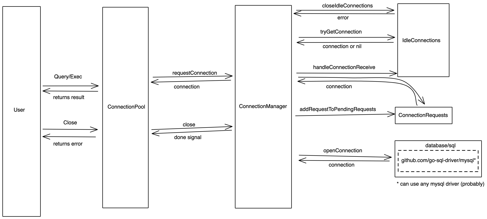

# Design

This connection pool has two main components, `ConnectionPool` and `ConnectionManager`. An analogy
of their function and how they relate to each other is `ConnectionPool` is like an HTTP client 
library and  `ConnectionManager` is like the HTTP service. The `ConnectionManager.idleConnections` 
map is like the database backing the `ConnectionManager` service. 

`ConnectionPool` requests connections from the `ConnectionManager`
and waits until a connection is returned or a canceling condition is reached. `ConnectionPool` then 
uses the connection to execute a SQL command provide by the caller. When the command completes
`ConnectionPool` returns the used connection back to the `ConnectionManager`

If `ConnectionManager` cannot immediately send a connection back to `ConnectionPool`, 
`ConnectionManager` adds the request for the connection to a list of pending requests.

Once the `ConnectionManager` receives the used connection it adds it back into the `idleConnections`
map and removes and connections which have been idle longer than the user defined `idleTimeout`. 
If there are any pending requests `ConnectionManager` will try to fulfill as many pending requests
as possible, limited by the user provided `totalConnection` parameter.

 

## ConnectionPool 
ConnectionPool provides the main interface to the user. The methods are provided:
- `Query(context, authentication, database, sql query)`
  - Query executes a query against a given database with the given authentication information.
  - Query returns `*sql.Rows` and an error, if any.
- `Exec(context, authentication, database, sql statement)`
  - Query executes a query against a given database with the given authentication information.
  - Query returns `*sql.Result` and an error, if any.
- `Close()`
  - Close closes all idle connections. After `Close()` is called the ConnectionPool can no longer be 
    used.
  - Close returns an error, if any.

## ConnectionManager
`ConnectionManager` manages all requests for database connections. Either sending a connection back
or queuing the request to fulfill later once a connection is returned to the pool.

`ConnectionManager` tries to send a database connection using the following procedure:
1. Send an idle connection matching the requested connection details if one is available.
2. If the connection pool is not yet full, open a new connection as needed.
3. If the connection pool is full, but has idle connections associated with other connection 
   details, close an idle connection associated with the least recently used connection details.
4. If the connection pool is full and has no idle connections add the connection request to the
   list of `pendingRequests`.

## Assumptions
- The library assumes a database driver is imported which is compatible with the sql/driver.Driver 
  interface.
- If a query has errored we don't want to add the connection that executed the query back to the 
  connection pool because there could be something wrong with it. This logic could be improved by
  adding connections whose query returned an error back to the connection pool only if the error 
  indicates that the connection itself was not responsible for the error.
- An idle timeout less than or equal to 0 results in no idle timeout.
- The user does not need to know about connection close errors when:
  - returning a connection to the pool and connections are pruned, if a stale connection's close 
    method returns an error.
  - retuning errored connection to pool and the pool tries to close the connection.

## Not Implemented
### Using a raw SQL connection
This implementation's represntation of a SQL Connection is a [sql.DB](https://golang.org/pkg/database/sql/#DB). This choice was made so that implementing logic to handle querying using the actual connection to the database could be ignored. Instead this implementation uses the Golang sql package to form and execute a transaction against the database. The code written here is focused on handling connections using channels.

### Specific behavior of Close()
The spec requests that for the `Close()` method: 
> Once this method is called, all queries should be terminated and connections should be closed.

The underlying connection which ConnectionPool uses is a `*sql.DB`. When `sql.DB's` `Close()` method 
is called queries which have begun executing on the database are allowed to finish.

> // Close closes the database and prevents new queries from starting.
// Close then waits for all queries that have started processing on the server
// to finish.

source: go1.13.5 sqldb.go ln:822  

Additionally the connection's queries are executed with a `sql.DB` which accepts only one context
as a parameter for cancellation. I have chosen to pass the query method the context which has been 
provided by the user. This means that when ConnectionPool's `Close()` method is  called, which 
cancels only the ConnectionManagers context, any work being done by `sql.DB` at the time will 
continue and be allowed to complete. This is not a huge issue now, because ConnectionManager's
`Query`  and `Exec` methods only execute one query per invocation. Thus only one query could 
possibly be executed after ConnectionPool's `Close()` method has been called per invocation of 
`Query` or `Exec`. To improve this situation the user's context and `ConnectionManagers` contexts
could be merged. This is possible to hand roll but is not a built in function of Go's context
package.

# Developing
## Testing
- Run `make test` to install dependencies, generate mocks, and to run all library tests. 
- Tests are executed with a mock sql.DB.

## Debug logging & request tracing
In pool.go the call to `NewConnectionManager` can be modified to pass `true` for the final `debug`
argument.
The `Query` and `Exec` methods take a context. Add a request ID to the context to add that value
to the debug logs. Including debug logging, even when not used, is detrimental to the performance of
the library. I chose to include it because it was useful during development and it's kind of fun.
```go
id := 1
ctx = context.WithValue(ctx, connectionpool.ContextRequestID, id)
```

